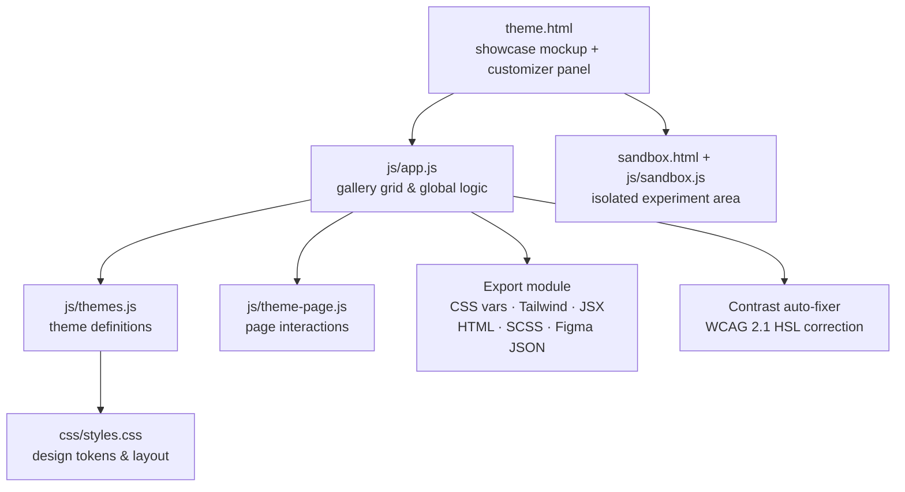

# AUDIRA THEMA — Interactive UI Theme Playground


A zero-dependency, full-screen web app for exploring, editing, and exporting UI design systems. Tweak colors, typography, and layouts on a live mockup, then export the result as ready-to-use code.

## About

Picking a design system usually means editing tokens blind and rebuilding to see the result. AUDIRA THEMA closes that loop: a live customizer panel drives a realistic showcase layout in real time, so designers and developers can experiment with palettes, fonts, and component styles before committing to code.

## Features

- **Live customizer panel** — edit primary, secondary, background, and surface colors; every component updates instantly
- **Responsive device switcher** — preview at desktop (1200px), tablet (768px), and mobile (375px) widths
- **Layout templates** — switch the showcase between dashboard analytics, SaaS landing page, and minimalist blog/portfolio mockups
- **Google Fonts integrator** — apply popular typefaces and watch typography adapt
- **WCAG contrast auto-fixer** — one-click HSL-based correction for readable text on any background
- **Theme cross-breeding** — combine one theme's palette with another's typography and layout
- **One-click code export** — generates copy-paste-ready output as:
  - CSS custom properties
  - Tailwind CSS config
  - React JSX components
  - HTML boilerplate
  - SCSS tokens
  - Figma JSON tokens
- **Sound effects** — subtle Web Audio API clicks and chimes

## Tech Stack

Strictly **zero runtime dependencies**: HTML5, vanilla JavaScript (ES6+), vanilla CSS3. No bundler required — serve the folder with any static file server. Layouts use Flexbox, CSS Grid, and CSS custom properties.

## Architecture



## Getting Started

No build step. Either open `theme.html` directly in a browser, or serve the folder:

```bash
npx serve .
# then open http://localhost:3000/theme.html
```

Entry points:

| File | Purpose |
|---|---|
| `theme.html` | Main playground (customizer + showcase) |
| `index.html` | Landing / entry page |
| `sandbox.html` | Isolated area for experiments |

## Project Structure

```text
theme.html            # Main playground
index.html            # Entry page
sandbox.html          # Experiment sandbox
css/styles.css        # Design system & layout
js/
  app.js              # Gallery grid & global logic
  themes.js           # Theme definitions
  theme-page.js       # Page interactions
  sandbox.js          # Sandbox logic
THEMES.md             # Theme catalog notes
```

## Screenshots

> Screenshots of the playground will be added here. To see it live, open `theme.html` in a browser — no build required.

## License

Proprietary commercial software. See [LICENSE](LICENSE).

## Author

**Agus Dwi R** — Data Center Engineer, Batam, Indonesia.
